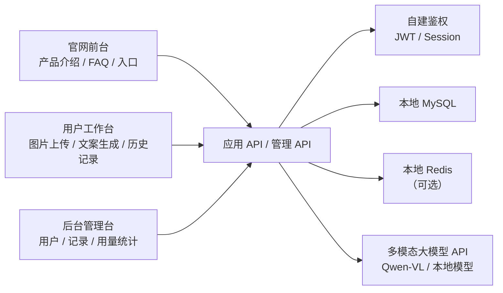
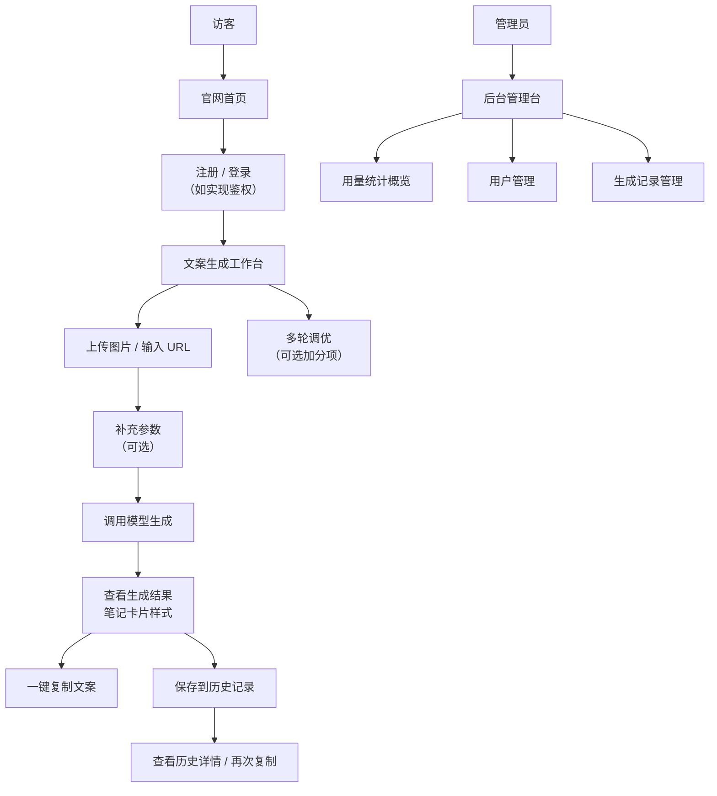

# PRD：图片小红书文案生成平台

状态：Draft v0.1  
目标：明确产品边界、页面结构、数据模型与核心业务流程，再进入开发。

## 1. 项目定位

这是一个面向内容创作者、电商运营者和品牌营销人员的 AI 图片转小红书文案工具。它不是单次调用模型的 Demo，而是一套带图片识别、文案生成、结果展示、历史回溯的完整产品。

一句话定义：
做一个支持上传图片或输入图片 URL，通过多模态大模型识别内容并自动生成小红书风格种草文案（含标题、正文、话题标签）的 AI 文案工作台。

系统总览：



## 1.1 技术选型建议

- 前端框架：`Vue 3 + TypeScript`，使用 `Vite` 构建
- 后端框架：`Java + SpringBoot`
- 用户鉴权：自建鉴权（本地用户表 + JWT / Session），不使用第三方云鉴权服务
- 数据库：本地部署 `MySQL`（本机或 Docker 容器）
- 缓存（如使用）：本地部署 `Redis`
- AI 能力：后端统一适配层对接多模态大模型 API（默认阿里云百炼 Qwen-VL），有时间、笔记本有足够性能可本地部署开源多模态模型
- 部署：提供 `Dockerfile` 及构建说明（加分项）

站点入口约定：

- 官网前台：`/`
- 用户工作台：`/workspace`
- 后台管理台：`/admin`

## 1.2 竞品参考（官方）

- [Jasper](https://www.jasper.ai/)
- [Copy.ai](https://www.copy.ai/)
- [小红书创作中心](https://creator.xiaohongshu.com/)

## 1.3 产品借鉴点

本项目的产品设计建议参考这些真实产品的做法：

- 借鉴 `Jasper` 的官网表达方式：强调内容创作场景、价值主张、平台能力和 CTA 转化
- 借鉴 `Copy.ai` 的工作台思路：让"生成"不是一个孤立按钮，而是一个带上下文（图片 + 补充参数）和多种产出类型（标题、正文、标签）的工作空间
- 借鉴 `小红书` 的笔记卡片样式：生成结果以真实小红书笔记卡片呈现，增强代入感和可用性
- 因此本项目的工作台、结果展示页和历史记录页，都应该更像一个真实内容创作工具，而不是单页 Demo

## 1.4 竞品页面拆解

建议重点参考的竞品页面结构：

- `Jasper` 官网首页
  - 重点看：Hero、品牌价值表达、场景介绍、演示 CTA、信任背书
- `Copy.ai` 的文案生成工作台
  - 重点看：结构化输入（上下文 + 参数）-> 输出结果的完整工作流，不是单纯展示一个文本框
- `小红书` 笔记详情页
  - 重点看：标题、正文、话题标签的排版方式，以及卡片式信息架构

因此本项目建议页面设计不是"一个上传框 + 一个结果框"，而是：

- 首页负责转化和价值传递
- 工作台负责图片输入、参数补充与生成触发
- 结果页负责以小红书笔记卡片样式呈现生成内容
- 历史页负责内容复用与回溯
- 后台负责运营视角的数据查看

## 2. 目标用户与核心目标

目标用户：

- 需要快速产出小红书种草笔记的内容创作者
- 管理多个 SKU 产品图、需要批量生成文案的电商运营者
- 负责品牌社媒内容投放的营销人员
- 想体验 AI 辅助创作流程的普通用户

核心目标：

- 用户能在 3 分钟内完成图片上传并获取第一篇小红书文案
- 用户能以小红书笔记卡片样式查看生成结果，并支持一键复制
- 用户能查看历史生成记录并二次复用
- 管理员能在后台查看用户数据、生成记录和用量统计

## 3. MVP 范围

第一版必须包含（基础要求）：

- 用户工作台：图片上传 / URL 输入、文案生成、结果展示与复制
- 图片输入与识别：支持本地上传或 URL 输入（至少实现一种）
- 小红书文案生成：基于图片内容生成标题（20字以内）、正文（种草口吻）、话题标签（3~5个）
- 结果展示：以小红书笔记卡片样式呈现，支持一键复制
- 异常处理：图片格式不支持、模型调用失败、网络超时等场景有明确错误提示
- 数据持久化：生成记录写入本地 MySQL

第一版可选（加分项，按需选做）：

- 官网前台：产品介绍、功能亮点、FAQ、使用入口
- 用户登录鉴权：注册、登录、退出、页面访问控制（未登录不能访问工作台与历史记录）
- 历史记录页：生成历史的持久化存储与结构化展现
- 后台管理台：仅管理员可访问，包含用户列表、生成记录、用量统计概览
- 参数调优：支持用户补充可选输入（产品名称、目标人群、语气风格）影响生成结果
- 多轮调优与多版本：针对生成结果继续提出修改意见进行迭代，或一次生成多个版本供选择
- 流式输出：文案生成过程以 SSE / WebSocket 方式逐字呈现
- 全链路本地化：通过 Ollama / vLLM 本地部署开源多模态模型，不调用云端 API
- Docker 部署：提供 Dockerfile 及镜像，支持便捷迁移部署

第一版不做：

- 支付 / 订阅 / 计费功能（题目明确禁止）
- 团队协作与权限细分
- 模板市场
- 批量图片处理（一次上传多张图生成多篇文案）
- 多语言支持
- 云端 BaaS 服务（Supabase、Firebase 等）

## 4. 角色与权限

| 角色 | 权限 |
|------|------|
| 游客 | 浏览官网首页、注册登录（如实现官网前台和鉴权） |
| 注册用户 | 上传图片、生成文案、查看历史记录、复制生成结果 |
| 管理员 | 访问后台管理台、查看用户列表、查看生成记录、查看用量统计 |

权限控制要求：

- 未登录用户不能访问工作台与历史记录页（如实现登录鉴权）
- 普通用户不能访问后台管理台
- 用户只能查看自己的生成历史（数据隔离）

## 5. 页面架构

当前 PRD 定义为 `3 套入口，7 个大页面`：

- 官网前台 `1` 个大页面
- 用户工作台 `3` 个大页面
- 后台管理台 `3` 个大页面

### 官网前台

#### 1. 官网首页 `/`

核心功能：

- Hero 区域：产品 Slogan + 快速进入工作台 CTA
- 功能亮点：图片识文、小红书风格、一键复制
- 输出示例：展示真实生成效果的小红书笔记卡片样例
- FAQ：常见问题解答
- 页脚：团队信息、GitHub 链接

### 用户工作台

#### 2. 登录页 `/login`（加分项）

核心功能：

- 用户名/邮箱 + 密码登录
- 跳转注册页
- 登录成功后跳转工作台

#### 3. 注册页 `/register`（加分项）

核心功能：

- 新用户注册（用户名、邮箱、密码）
- 注册完成自动登录并跳转工作台

#### 4. 文案生成工作台 `/workspace`

核心功能：

- 图片输入区：
  - 本地上传图片（拖拽/点击）
  - 或输入在线图片 URL 加载预览
  - 图片预览与删除重传
- 参数补充区（可选）：
  - 产品名称输入
  - 目标人群选择/输入
  - 语气风格选择（活泼/温柔/专业/搞笑等）
- 生成触发：提交生成按钮
- 结果展示区：
  - 小红书笔记卡片样式（标题、正文、标签分区展示）
  - 一键复制全文
  - 单独复制标题 / 正文 / 标签
  - 重新生成按钮
- 状态管理：
  - 图片上传 loading
  - 文案生成 loading（如支持流式则逐字呈现）
  - 空状态（未上传图片时的引导）
  - 错误状态（格式不支持、模型失败、超时等明确提示）

#### 5. 历史记录页 `/history`（加分项）

核心功能：

- 查看历史生成记录列表（图片缩略图、生成标题、生成时间）
- 点击单条记录查看详情（图片、输入参数、生成结果）
- 支持复制历史文案
- 支持删除单条记录
- 空状态设计

### 后台管理台

#### 6. 后台首页 `/admin`（加分项）

核心功能：

- 用户总数
- 今日/累计生成次数
- 每日生成次数趋势图
- 高频使用时段概览

#### 7. 用户管理 `/admin/users`（加分项）

核心功能：

- 查看用户列表（账号、角色、注册时间）
- 查看用户最近活跃
- 管理员与普通用户角色标识

#### 8. 生成记录 `/admin/generations`（加分项）

核心功能：

- 查看所有生成记录（用户、图片缩略图、标题、生成时间）
- 按用户/时间筛选
- 查看失败记录与错误原因

## 5.1 关键用户链路



关键状态流：

- 游客 -> 注册用户（如实现鉴权）
- 图片上传中 -> 上传成功 / 上传失败（格式不支持等）
- 文案生成中 -> 生成成功 / 生成失败（模型调用失败、超时等）
- 历史记录：已保存 -> 已查看 -> 已删除

## 6. 后端实现

后端模块：

- `auth`：用户注册、登录、鉴权（JWT / Session）
- `upload`：图片上传处理（本地存储或 Base64 流转）
- `recognition`：调用多模态大模型识别图片内容
- `generation`：基于识别结果生成小红书文案（标题、正文、标签）
- `history`：生成历史的增删查改
- `admin`：后台数据统计与管理接口

### 6.1 数据表设计

```sql
-- 用户表（如实现登录鉴权）
create table users (
  id bigint unsigned primary key auto_increment,
  username varchar(50) not null unique,
  email varchar(100) not null unique,
  password_hash varchar(255) not null,
  role enum('user', 'admin') default 'user',
  created_at datetime default current_timestamp,
  updated_at datetime default current_timestamp on update current_timestamp
);

-- 生成记录表
create table generation_records (
  id bigint unsigned primary key auto_increment,
  user_id bigint unsigned,
  image_url varchar(500) not null comment '图片存储路径或URL',
  image_base64 text comment '图片base64（如本地存储）',
  product_name varchar(100) comment '产品名称（可选参数）',
  target_audience varchar(100) comment '目标人群（可选参数）',
  tone_style varchar(50) comment '语气风格（可选参数）',
  generated_title varchar(100) not null comment '生成标题',
  generated_content text not null comment '生成正文',
  generated_tags varchar(500) comment '生成话题标签，逗号分隔',
  model_used varchar(50) comment '使用的模型名称',
  status enum('pending', 'success', 'failed') default 'pending',
  error_message text comment '失败原因',
  created_at datetime default current_timestamp,
  updated_at datetime default current_timestamp on update current_timestamp,
  foreign key (user_id) references users(id) on delete set null
);

-- 管理员可扩展：用量统计视图或每日汇总表（可选）
create table daily_stats (
  id bigint unsigned primary key auto_increment,
  stat_date date not null unique,
  total_generations int default 0,
  success_count int default 0,
  failed_count int default 0,
  unique_users int default 0,
  created_at datetime default current_timestamp
);
```

## 6.2 后台指标与监控

后台建议至少查看这些指标：

- 新增注册用户数（按日/周/月）
- 日活跃生成用户数
- 文案生成总次数（成功/失败）
- 生成成功率 / 失败率
- 高频生成时段分布
- 平均生成耗时
- 模型调用成功率与响应时间

基础监控建议：

- 模型 API 调用成功率与平均耗时
- 后端接口响应时间
- 数据库连接状态与慢查询
- 图片上传大小与格式异常统计
- 关键任务错误日志（模型调用失败、数据库写入失败等）

## 7. 功能清单

必须完成（核心功能）：

- [ ] 图片输入：支持本地上传或 URL 输入（至少一种）
- [ ] 图片识别：后端将图片发送给多模态大模型，获取识别结果
- [ ] 文案生成：基于识别结果生成小红书风格文案（标题、正文、标签）
- [ ] 结果展示：以小红书笔记卡片样式呈现，支持一键复制
- [ ] 异常处理：图片格式不支持、模型调用失败、网络超时等明确错误提示
- [ ] 数据持久化：生成记录写入本地 MySQL
- [ ] 项目可本地启动，README 完整

可选增强（加分项，按需选做）：

- [ ] 官网前台：产品介绍、功能亮点、FAQ、使用入口
- [ ] 用户登录鉴权：注册、登录、退出、JWT/Session 自建鉴权
- [ ] 历史记录：持久化存储与结构化展现，支持查看与删除
- [ ] 后台管理台：用户管理、生成记录、用量统计概览（仅管理员）
- [ ] 参数调优：支持产品名称、目标人群、语气风格等可选输入
- [ ] 多轮调优：针对生成结果提出修改意见进行迭代优化
- [ ] 多版本生成：一次生成多个版本供用户选择
- [ ] 流式输出：文案生成以 SSE / WebSocket 逐字呈现
- [ ] 全链路本地化：本地部署开源多模态模型（Ollama / vLLM）
- [ ] Docker 部署：提供 Dockerfile 及构建运行说明
- [ ] 界面美观：视觉风格像真实产品，非课堂 Demo

## 8. 接口草案

### 认证相关（加分项）

| 方法 | 路径 | 说明 |
|------|------|------|
| `POST` | `/api/auth/register` | 用户注册 |
| `POST` | `/api/auth/login` | 用户登录 |
| `POST` | `/api/auth/logout` | 用户退出 |
| `GET`  | `/api/auth/me` | 获取当前登录用户信息 |

### 核心生成链路

| 方法 | 路径 | 说明 |
|------|------|------|
| `POST` | `/api/upload` | 上传本地图片，返回图片访问地址 |
| `POST` | `/api/generate` | 提交生成任务（图片URL/路径 + 可选参数） |
| `GET`  | `/api/generate/stream` | 流式生成文案（SSE，加分项） |

### 历史记录（加分项）

| 方法 | 路径 | 说明 |
|------|------|------|
| `GET`  | `/api/history` | 获取当前用户历史记录列表 |
| `GET`  | `/api/history/:id` | 获取单条历史记录详情 |
| `DELETE` | `/api/history/:id` | 删除单条历史记录 |

### 后台管理（加分项，需管理员权限）

| 方法 | 路径 | 说明 |
|------|------|------|
| `GET` | `/api/admin/overview` | 获取后台总览数据 |
| `GET` | `/api/admin/users` | 获取用户列表 |
| `GET` | `/api/admin/generations` | 获取所有生成记录 |
| `GET` | `/api/admin/stats/daily` | 获取每日用量统计 |

## 9. 非功能要求

- **生成过程反馈**：图片上传和文案生成过程需有清晰 loading 状态，失败时给出明确错误提示（如"图片格式不支持，请上传 jpg/png"、"模型调用超时，请重试"）
- **数据隔离**：用户历史记录只能自己可见，管理员可查看所有记录
- **权限控制**：未登录用户不能访问工作台与历史记录页；普通用户不能访问后台管理台
- **密钥安全**：所有 Key（模型 API Key、数据库密码等）放在环境变量中，严禁硬编码或上传到代码仓库
- **响应式设计**：工作台在桌面端和移动端均可正常使用
- **性能要求**：单次文案生成（不含流式）应在 15 秒内完成，超时需友好提示
- **代码规范**：Git commit 信息规范，按功能单元分次提交

## 10. 开发顺序建议

### 第 1~2 天：需求拆解 + 项目骨架

1. 阅读题目需求，拆解功能清单
2. 确定技术选型（Vue/React、SpringBoot/FastAPI）
3. 搭建前端项目骨架（Vite + 组件库）
4. 搭建后端项目骨架 + 本地 MySQL 连接
5. 设计数据库表结构
6. 组内分工明确

### 第 3~4 天：后端核心链路

1. 实现图片上传接口（或 URL 接收接口）
2. 对接多模态大模型 API（Qwen-VL），完成图片识别
3. 实现文案生成逻辑（基于识别结果构造 Prompt，调用大模型生成标题、正文、标签）
4. 将生成结果写入 MySQL
5. 联调"上传图片 -> 识别 -> 生成 -> 落库"完整链路

### 第 5 天：前端工作台 + 结果展示

1. 实现图片上传/URL 输入 UI
2. 实现可选参数输入（产品名称、语气风格等）
3. 调用后端接口完成端到端联调
4. 实现小红书笔记卡片样式结果展示
5. 实现一键复制功能
6. 完善 loading 状态与空状态设计

### 第 6~7 天：加分项拓展 + 联调打磨

1. 按需实现登录鉴权、历史记录、官网前台、后台管理台
2. 实现流式输出（如选做）
3. 编写 Dockerfile（如选做）
4. 完善 README（项目简介、分工、启动步骤、环境变量清单）
5. 全链路自测，确保现场演示流程顺畅

## 11. 待确认项

- [ ] 前端框架确定：Vue 3 还是 React？
- [ ] 后端框架确定：SpringBoot 还是 FastAPI？
- [ ] 图片输入方式：优先实现本地上传还是 URL 输入，还是两者都做？
- [ ] 图片存储方式：本地文件系统存储、Base64 存数据库、还是仅传递 URL？
- [ ] 登录鉴权方式：JWT 还是 Session？
- [ ] 是否支持流式输出？
- [ ] 是否本地部署多模态模型，还是仅调用云端 API？
- [ ] 是否一次生成多个版本供选择？
- [ ] 是否支持多轮调优（用户反馈修改意见后重新生成）？
- [ ] 小组分工如何安排（前端、后端、数据库、联调部署）？

---

## 附录：Prompt 参考模板

### 图片识别 Prompt

```
请仔细识别这张图片的内容，描述图片中的主要元素、场景、物品、氛围和风格。
要求：
1. 客观描述图片中的主体物品/人物/场景
2. 描述颜色、材质、光线等视觉特征
3. 描述图片传达的氛围和情绪
4. 如果涉及商品，请说明可能的商品类别和卖点
5. 输出控制在 200 字以内
```

### 小红书文案生成 Prompt

```
你是一位小红书爆款文案写手。请根据以下图片识别结果，生成一篇小红书风格的种草文案。

图片内容描述：{image_description}
产品名称：{product_name}（如提供）
目标人群：{target_audience}（如提供）
语气风格：{tone_style}（如提供，可选：活泼/温柔/专业/搞笑/治愈）

要求：
1. 标题：20字以内，吸引眼球，符合小红书爆款标题风格，可适当使用 emoji
2. 正文：种草口吻，分段清晰，风格自然亲切，适当使用 emoji 和口语化表达，200-400字
3. 话题标签：3-5个，与图片内容高度相关，格式为 #标签名
4. 输出格式：
   标题：[标题内容]
   正文：[正文内容]
   标签：[#标签1 #标签2 #标签3]
```

### 多轮调优 Prompt（加分项）

```
请根据用户的修改意见，对之前生成的小红书文案进行优化。

原文案：
标题：{original_title}
正文：{original_content}
标签：{original_tags}

用户修改意见：{user_feedback}

要求：保留原有文案的优点，重点针对用户意见进行调整，保持小红书风格不变。
```
